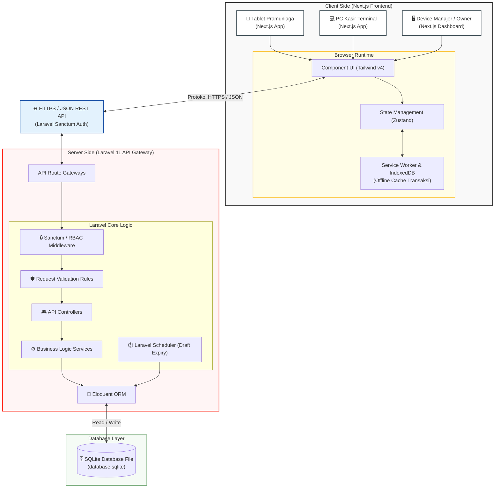

# 🖥️ Arsitektur Sistem & Struktur Direktori POS

Dokumen ini menjelaskan **Arsitektur Sistem (Deployment Diagram)** dan **Struktur Direktori Proyek** untuk mempermudah pengembangan *monorepo* atau *dual-repo* antara **Next.js (Frontend)** dan **Laravel (Backend)** dengan database **SQLite**.

---

## 1. Diagram Arsitektur & Deployment (Mermaid.js)

Berikut adalah diagram yang menunjukkan bagaimana komponen Frontend, Backend, dan Database saling berinteraksi, baik secara online maupun fallback offline.



### Penjelasan Alur Komunikasi:
1. **Client Request:** Klien (Pramuniaga/Kasir/Manajer) menggunakan aplikasi Next.js di browser. Data keranjang dan input dimasukkan ke UI.
2. **State & Offline Handling:** State aktif dikelola oleh *Zustand*. Jika jaringan offline, data transaksi antre disimpan di *IndexedDB* via *Service Worker*. Setelah kembali online, data di-sinkronisasi ke backend.
3. **API Call:** Komunikasi Next.js ke Laravel API menggunakan protokol HTTPS dengan muatan data berformat JSON. Otentikasi menggunakan token dari *Laravel Sanctum*.
4. **Logic Processing (Laravel):**
   * Request disaring oleh **RBAC Middleware** untuk mencocokkan Role/Hak Akses.
   * **Request Validation** memastikan tipe data valid (misal, SKU unik, minimal nominal).
   * **Controllers** mendelegasikan pemrosesan ke **Services** (misalnya pengurangan stok, pencatatan log audit).
5. **Database Operation:** **Eloquent ORM** memproses query ke file database lokal **SQLite** (`database.sqlite`).

---

## 2. Struktur Direktori Pengembangan (Clean Directory Structure)

Untuk menjaga kerapian selama fase development, kita membagi proyek ke dalam struktur folder terpisah untuk `frontend/` (Next.js) dan `backend/` (Laravel).

```text
pos-system/           # Root directory
├── backend/          # Laravel 11 (REST API)
└── frontend/         # Next.js 14 (App Router)
```

---

### A. Struktur Direktori Backend (Laravel 11)

Laravel 11 memiliki struktur folder yang lebih ringkas. Berikut pembagian folder yang direkomendasikan untuk memisahkan domain logika bisnis agar rapi:

```text
backend/
├── app/
│   ├── Http/
│   │   ├── Controllers/
│   │   │   ├── Api/
│   │   │   │   ├── AuthController.php          # Login, Logout, PIN Validation
│   │   │   │   ├── OrderDraftController.php    # Modul Pramuniaga
│   │   │   │   ├── TransactionController.php   # Modul Kasir (Pembayaran, Void)
│   │   │   │   ├── StockAdjustmentController.php# Modul Gudang (Approval)
│   │   │   │   └── ShiftController.php          # Modul Shift (Open, Close, Audit)
│   │   │   └── Controller.php
│   │   └── Middleware/
│   │       └── RoleMiddleware.php              # RBAC (SuperAdmin, Kasir, dll)
│   ├── Models/
│   │   ├── Store.php
│   │   ├── User.php
│   │   ├── Product.php
│   │   ├── OrderDraft.php
│   │   ├── Transaction.php
│   │   ├── Shift.php
│   │   └── AuditLog.php
│   └── Services/                               # Logika Bisnis Kompleks (PENTING!)
│       ├── StockService.php                    # Pengurangan stok riil, pergerakan stok
│       ├── PaymentService.php                  # Logic split payment, gateway interface
│       ├── ShiftAuditService.php               # Penghitungan selisih blind cash drop
│       └── AuditTrailService.php               # Handler pencatatan log immutable
├── bootstrap/
│   ├── app.php                                 # Pendaftaran Middleware
│   └── providers.php
├── config/
├── database/
│   ├── migrations/                             # Migrasi 12+ Tabel Database SQLite
│   ├── seeders/                                # Data default (Roles, Super Admin, Dummy Products)
│   └── database.sqlite                         # File SQLite Database Utama
├── routes/
│   ├── api.php                                 # Endpoint REST API (Terproteksi Sanctum)
│   └── web.php
└── tests/                                      # Automated testing
```

---

### B. Struktur Direktori Frontend (Next.js 14 App Router)

Next.js 14 menggunakan App Router. Folder components, store, dan service disusun teratur agar tidak berantakan:

```text
frontend/
├── public/                                     # Asset statis, logo, struk template
├── src/
│   ├── app/                                    # Routing App Router
│   │   ├── (auth)/
│   │   │   └── login/                          # Halaman Login
│   │   ├── dashboard/
│   │   │   ├── manager/                        # Panel Manajer (Harga, Karyawan)
│   │   │   ├── supervisor/                     # Panel Supervisor (Shift Audit)
│   │   │   └── stocker/                        # Panel Gudang (Restock, Opname)
│   │   ├── pos/                                # Layar Utama Kasir (POS Screen)
│   │   ├── pramuniaga/                         # Layar Input Order Draft (Tablet)
│   │   ├── layout.tsx
│   │   └── page.tsx                            # Landing Page redirect
│   ├── components/                             # Reusable UI Components
│   │   ├── ui/                                 # Button, Input, Modal, Table (Tailwind v4)
│   │   ├── pos/                                # Component spesifik POS (Keranjang, Kembalian)
│   │   └── shared/                             # Header, Sidebar, Footer
│   ├── hooks/                                  # Custom React Hooks
│   │   ├── useAuth.ts
│   │   └── useOffline.ts                       # Tracking status koneksi & sinkronisasi
│   ├── services/                               # Client API Calls (Axios / Fetch)
│   │   ├── api.ts                              # Base configuration (Headers, Interceptors)
│   │   ├── auth.service.ts
│   │   ├── product.service.ts
│   │   └── transaction.service.ts
│   └── store/                                  # State Management (Zustand)
│       ├── useAuthStore.ts                     # User session & token
│       ├── useCartStore.ts                     # Keranjang belanja aktif & hold-resume
│       └── useShiftStore.ts                    # Status shift aktif (SHIFT-id, opening_cash)
├── next.config.js
├── package.json
├── tailwind.config.js                          # Konfigurasi Tailwind v4
└── tsconfig.json
```

---

## 3. Best Practices & Aturan Penulisan Kode (Development Rules)

1. **Keep Controllers Skinny, Models/Services Fat:**
   * Jangan menulis logika kalkulasi harga, diskon, atau pengurangan stok di controller. Gunakan Class Service di folder `app/Services/` agar kode backend mudah di-test.
2. **Immutable Audit Logging:**
   * Semua pemanggilan log audit (`audit_logs`) harus dilewatkan melalui `AuditTrailService`.
   * Di level database, buat seeder atau trigger agar tidak ada fungsi API `delete` yang mengarah ke tabel `audit_logs`.
3. **Zustand Local Storage Persistence:**
   * Guna mendukung fungsi *Hold & Resume* dan mencegah hilangnya transaksi kasir jika tab browser tertutup secara tidak sengaja, gunakan middleware `persist` dari Zustand untuk menyimpan state `useCartStore` di LocalStorage/IndexedDB.
4. **Strict API Response Format:**
   * Semua API Controller di Laravel wajib mengembalikan JSON dengan struktur format seragam:
     ```json
     {
       "success": true,
       "message": "Detail pesan sukses",
       "data": { ... }
     }
     ```
