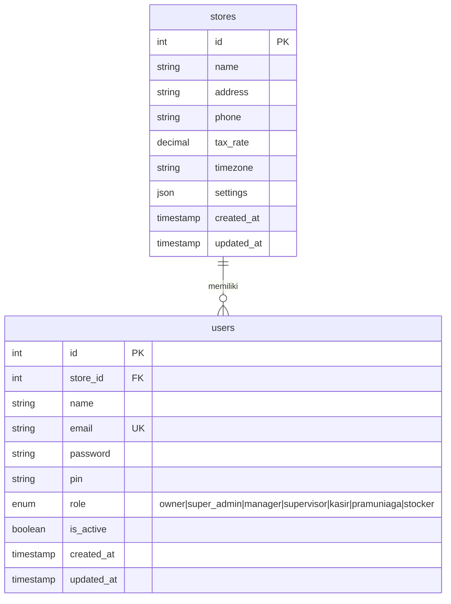
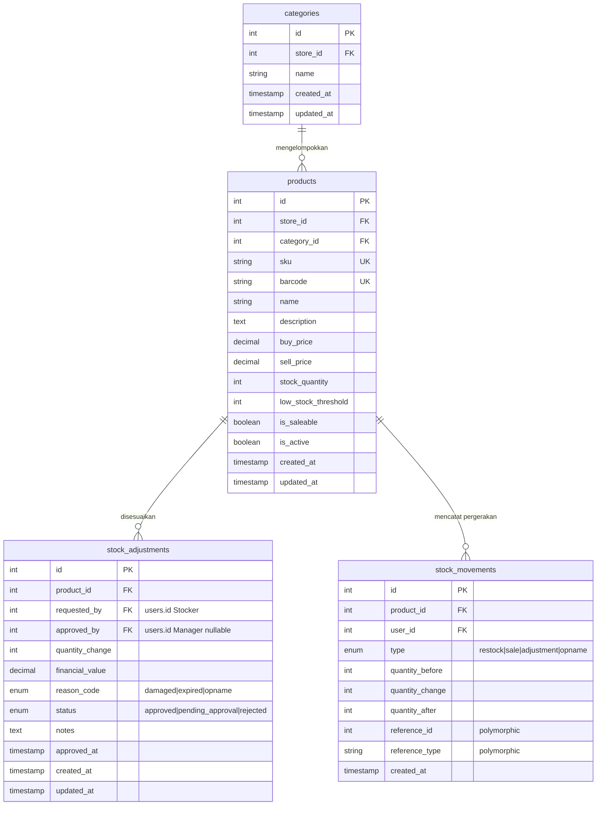
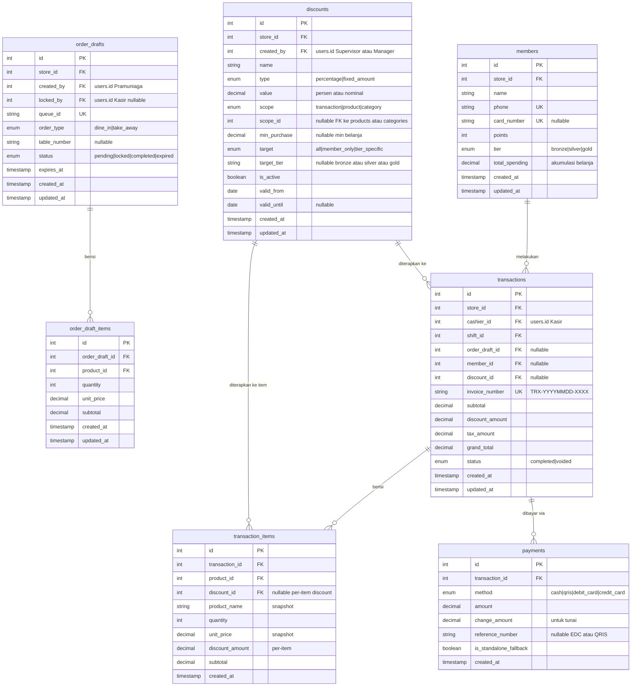
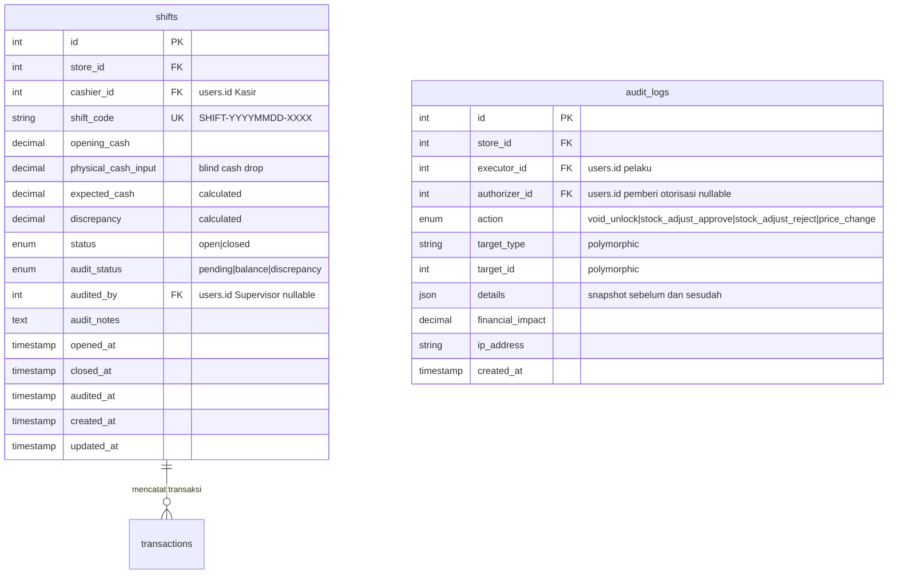
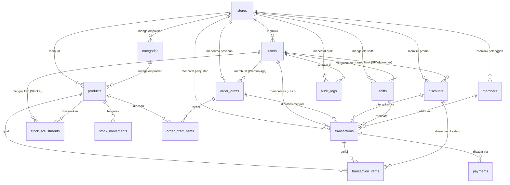

# 📐 Entity Relationship Diagram (ERD) — Sistem Point of Sale (POS)

Dokumen ini berisi rancangan **Entity Relationship Diagram (ERD)** lengkap untuk Sistem POS berdasarkan [PRD](./PRD_POS.md), [Use Case Diagram](./Use_Case_Diagram.md), dan [Sequence Diagram](./Sequence_Diagram.mermaid) yang telah disetujui.

---

## 1. Tech Stack

| Layer | Teknologi | Keterangan |
|---|---|---|
| **Backend API** | Laravel 11 (PHP 8.3) | RESTful API, Eloquent ORM, middleware auth, scheduler |
| **Frontend** | Next.js 14 (App Router) | SSR/CSR hybrid, React Server Components |
| **Database** | **SQLite** (fase awal) | Ringan, zero-config. Migrasi ke MySQL/PostgreSQL saat scaling |
| **Auth** | Laravel Sanctum | Token-based SPA authentication |
| **State Management** | Zustand / React Context | Keranjang belanja & session kasir |
| **Styling** | Tailwind CSS v4 | Konsisten dengan Next.js ecosystem |
| **PDF/Struk** | Laravel DomPDF / ESC-POS | Struk digital (PDF) & thermal printer |
| **Offline Cache** | Service Worker + IndexedDB | Fallback offline transaksi kasir |
| **API Docs** | Swagger / Scramble | Auto-generate dokumentasi API |
| **Payment Gateway** | *TBD* (Midtrans / Xendit) | Belum dipilih, disiapkan interface abstrak |

> **Catatan Arsitektur:**
> - **Single-store terlebih dahulu**, namun kolom `store_id` tetap dipertahankan di semua tabel agar siap untuk pengembangan multi-cabang di masa depan tanpa refactor skema database.
> - **SQLite** digunakan sebagai database utama di fase awal. Jika nanti butuh concurrent write tinggi (> 3 kasir simultan), cukup ganti `DB_CONNECTION` di `.env` ke `mysql` tanpa ubah kode migrasi.

---

## 2. ERD per Cluster

### Cluster 1: Core & User Management

Mengelola data toko dan seluruh aktor pengguna sistem dengan pembagian hak akses berbasis peran (RBAC).

**Penjelasan:**
- **`stores`** — Data toko/cabang. Field `settings` (JSON) menyimpan konfigurasi global (nama toko, pajak, integrasi payment gateway). Kolom `store_id` disiapkan di semua tabel agar siap multi-cabang.
- **`users`** — Semua aktor dalam satu tabel dengan pembeda kolom `role` (enum: `owner`, `super_admin`, `manager`, `supervisor`, `kasir`, `pramuniaga`, `stocker`). Field `pin` digunakan untuk otorisasi Supervisor & Manajer saat Void atau Approve Stock Adjustment.

---

### Cluster 2: Inventory (Modul Gudang)

Mengelola master produk, kategori, pencatatan penyesuaian stok, dan log pergerakan stok secara immutable.

**Penjelasan:**
- **`products`** — Master produk dengan `sku` dan `barcode` unik (validasi backend Laravel). `sell_price` hanya bisa diubah oleh Manager/Owner (enforced via RBAC middleware). Kolom `is_saleable` (default true) digunakan untuk mengidentifikasi apakah produk dijual langsung atau bertindak sebagai bahan baku non-saleable.
- **`stock_adjustments`** — Pengajuan adjust stok oleh Stocker. Jika `financial_value > 100000`, kolom `status` otomatis diset `pending_approval` oleh backend. Manager meng-approve via PIN → `approved_by` dan `approved_at` terisi.
- **`stock_movements`** — Log **immutable** (Read-Only) setiap pergerakan stok. Polymorphic `reference_id` + `reference_type` menunjuk ke sumber pergerakan (misal: `transaction_items`, `stock_adjustments`, dll).

---

### Cluster 3: Transaction, Draft & Diskon (Modul Kasir, Pramuniaga & Membership)

Mengelola siklus hidup pesanan dari draf hingga pembayaran selesai, termasuk membership pelanggan dan sistem diskon.

**Penjelasan:**
- **`order_drafts`** — Draf pesanan dari Pramuniaga. `expires_at = created_at + 2 jam`. Laravel Scheduler (`php artisan schedule:run`) otomatis ubah status ke `expired`. Saat Kasir menarik draft, `locked_by` terisi dan `status` berubah ke `locked`.
- **`transactions`** — Transaksi final. `invoice_number` di-generate backend dengan format `TRX-YYYYMMDD-XXXX`, counter auto-reset setiap pergantian hari. Field `discount_id` mereferensikan diskon yang diterapkan pada level transaksi.
- **`transaction_items`** — **Snapshot** harga & nama produk saat transaksi. Field `discount_id` dan `discount_amount` per-item mencatat diskon spesifik produk.
- **`payments`** — Mendukung **Split Payment**: 1 transaksi bisa memiliki 2+ record pembayaran (misal: Rp 50.000 Tunai + Rp 100.000 QRIS). Field `is_standalone_fallback` mencatat jika pembayaran EDC dilakukan via konfirmasi manual.
- **`members`** — Data membership pelanggan. Poin otomatis bertambah post-payment. Field `total_spending` untuk tracking akumulasi belanja guna auto-upgrade tier.
- **`discounts`** *(BARU)* — Tabel diskon fleksibel yang mendukung:
  - **Tipe:** Persentase (`10%`) atau nominal tetap (`Rp 5.000`).
  - **Scope:** Berlaku per-transaksi, per-produk tertentu, atau per-kategori produk.
  - **Target:** Untuk semua pelanggan, khusus member, atau khusus tier tertentu (Gold saja, dll).
  - **Validity:** Periode berlaku diskon (`valid_from` s/d `valid_until`). Jika `valid_until` null, diskon berlaku tanpa batas waktu.
  - Dibuat oleh Supervisor (diskon harian) atau Manager (diskon strategis).

---

### Cluster 4: Security & Accountability (Audit & Shift)

Mengelola siklus shift kasir, rekonsiliasi kas, dan audit trail immutable untuk semua aksi sensitif.

**Penjelasan:**
- **`shifts`** — Satu record per sesi kerja kasir. Alur: `OPEN` (kasir input `opening_cash`) → Transaksi berjalan → `CLOSED` (kasir input `physical_cash_input` via Blind Cash Drop, TANPA melihat `expected_cash`). Supervisor melakukan audit: `discrepancy = physical_cash_input - expected_cash`. Status audit: `balance` (selisih Rp 0) atau `discrepancy` (Red Flag).
- **`audit_logs`** — **IMMUTABLE / Read-Only**. Tidak ada endpoint `DELETE` atau `UPDATE` di API. Mencatat semua aksi sensitif sesuai PRD:
  - **Void Unlock** — Kasir membuka kunci keranjang di fase pembayaran (butuh PIN Supervisor).
  - **Stock Adjust Approve/Reject** — Manajer menyetujui/menolak penyesuaian stok > Rp 100.000.
  - **Price Change** — Perubahan harga produk oleh Manager/Owner.
  - Field `details` (JSON) menyimpan snapshot data **sebelum & sesudah** perubahan untuk keperluan forensik audit.

---

## 3. Relasi Antar Cluster (Full Overview)

---

## 4. Core Features Checklist

### Cluster 1: Core & User Management
- [ ] CRUD User dengan Role-Based Access Control (RBAC)
- [ ] Login/Logout dengan Laravel Sanctum (token-based)
- [ ] PIN verification endpoint untuk Supervisor & Manager
- [ ] CRUD Store settings (nama, pajak, timezone)
- [ ] Middleware permission per-role di setiap API route

### Cluster 2: Inventory
- [ ] CRUD Produk (SKU/Barcode unique validation)
- [ ] CRUD Kategori Produk
- [ ] Input Barang Masuk (Restock) + auto stock_movements log
- [ ] Adjust Stok dengan Reason Code + batasan finansial Rp 100k
- [ ] Approval/Reject stock adjustment oleh Manager (PIN)
- [ ] Stock Opname (bandingkan fisik vs digital)
- [ ] Indikator Stok Kritis (low_stock_threshold alert)

### Cluster 3: Transaction, Draft & Diskon
- [ ] Create Order Draft oleh Pramuniaga (queue_id / table_number)
- [ ] Pull & Lock Draft oleh Kasir
- [ ] Draft auto-expiry (scheduler Laravel, 2 jam / end of day)
- [ ] Keranjang Pra-Bayar (edit qty, hapus item mandiri)
- [ ] Hold & Resume keranjang
- [ ] Validasi Membership (phone / card scan)
- [ ] Proses Pembayaran multi-method (Tunai, QRIS, Kartu)
- [ ] Split Payment support
- [ ] Invoice number auto-generate (TRX-YYYYMMDD-XXXX, daily reset)
- [ ] Cetak Struk (PDF digital + thermal printer ESC/POS)
- [ ] Async post-payment: potong stok, jurnal kas, poin member
- [ ] CRUD Diskon (persentase/nominal, scope per-transaksi/produk/kategori)
- [ ] Auto-apply diskon membership berdasarkan tier
- [ ] CRUD Member + tracking poin & total spending

### Cluster 4: Security & Accountability
- [ ] Open Shift (input modal awal, generate SHIFT code)
- [ ] Close Shift (Blind Cash Drop, auto-logout)
- [ ] Audit Shift (hitung selisih, status balance/discrepancy)
- [ ] Conditional Void (lock/unlock keranjang + PIN Supervisor)
- [ ] Audit Trail immutable (Read-Only, no DELETE/UPDATE API)
- [ ] Polymorphic logging (void, adjust, price change)

### Future Backlog Features (Rencana Pengembangan Lebih Lanjut)
- [ ] Multi-Tenant / Multi-Store (Isolasi data toko/tenant mandiri)
- [ ] Pengelolaan Stok Bahan Baku (`is_saleable` = false, dikecualikan dari menu POS)
- [ ] Akun & Monitoring Owner (Pembuatan tenant, monitoring performa multi-toko)
- [ ] Pagination Global server-side di seluruh tabel/halaman data
- [ ] Laporan Keuangan Penjualan & Pembelian format PDF

---

## 5. Product Backlog (Prioritas)

### 🔴 Priority 1 — MVP (Must Have)

| # | Backlog Item | Cluster | Sprint |
|---|---|---|---|
| 1 | Setup Laravel project + SQLite + Sanctum auth | Core | Sprint 1 |
| 2 | Setup Next.js project + auth integration | Core | Sprint 1 |
| 3 | CRUD Users & RBAC middleware | Core | Sprint 1 |
| 4 | CRUD Products & Categories (SKU/Barcode validation) | Inventory | Sprint 2 |
| 5 | Input Barang Masuk (Restock) | Inventory | Sprint 2 |
| 6 | Order Draft CRUD + auto-expiry scheduler | Transaction | Sprint 3 |
| 7 | Keranjang Kasir (Pull Draft / Scan Langsung) | Transaction | Sprint 3 |
| 8 | Proses Pembayaran (single method: Tunai) | Transaction | Sprint 3 |
| 9 | Invoice auto-generate + Cetak Struk (PDF) | Transaction | Sprint 3 |
| 10 | Open/Close Shift + Blind Cash Drop | Security | Sprint 4 |
| 11 | Audit Trail logging (Void & Adjust) | Security | Sprint 4 |
| 12 | Stock cutting post-payment (async) | Inventory | Sprint 4 |

### 🟡 Priority 2 — Enhanced (Should Have)

| # | Backlog Item | Cluster | Sprint |
|---|---|---|---|
| 13 | Split Payment & Multi-method | Transaction | Sprint 5 |
| 14 | QRIS / EDC integration + Standalone Fallback | Transaction | Sprint 5 |
| 15 | Conditional Void (PIN Supervisor unlock) | Security | Sprint 5 |
| 16 | Hold & Resume keranjang | Transaction | Sprint 5 |
| 17 | Membership & Loyalty Points + auto-tier upgrade | Transaction | Sprint 6 |
| 18 | CRUD Diskon (persentase/nominal, scope, target tier) | Transaction | Sprint 6 |
| 19 | Stock Adjustment + Approval workflow (Rp 100k rule) | Inventory | Sprint 6 |
| 20 | Stock Opname module | Inventory | Sprint 6 |
| 21 | Shift Audit (Supervisor reconciliation dashboard) | Security | Sprint 6 |

### 🟢 Priority 3 — Nice to Have (Could Have)

| # | Backlog Item | Cluster | Sprint |
|---|---|---|---|
| 22 | Offline Mode (Service Worker + IndexedDB) | Core | Sprint 7+ |
| 23 | Multi-store/branch support (aktivasi `store_id`) | Core | Sprint 7+ |
| 24 | Advanced Reporting (laba-rugi, performa karyawan) | Core | Sprint 7+ |
| 25 | Thermal Printer integration (ESC/POS) | Transaction | Sprint 7+ |
| 26 | Price change history & approval workflow | Inventory | Sprint 7+ |
| 27 | Dashboard analytics (grafik penjualan, trend) | Core | Sprint 7+ |
| 28 | Payment Gateway integration (Midtrans/Xendit) | Transaction | Sprint 7+ |

### 🔵 Priority 4 — Future Phase (Backlog Rencana Pengembangan)

| # | Backlog Item | Cluster | Sprint | Keterangan |
|---|---|---|---|---|
| 29 | Multi-Tenant (Banyak Toko / Cabang Terisolasi) | Core | Sprint 8+ | Sistem multi-tenant lengkap dengan domain/subdomain routing dan isolasi data per toko |
| 30 | Stok Bahan Baku (Non-Saleable Stock) | Inventory | Sprint 8+ | Manajemen inventori bahan baku produksi yang dikecualikan dari menu kasir/kiosk |
| 31 | Registrasi & Pemantauan Akun oleh Owner | Core | Sprint 8+ | Dashboard khusus Owner untuk registrasi toko baru, pendaftaran karyawan, dan audit real-time |
| 32 | Pagination Global | Core / UX | Sprint 8+ | Pagination server-side pada seluruh tabel data di frontend dan endpoint API backend |
| 33 | Laporan Keuangan Penjualan & Pembelian (PDF) | Core | Sprint 8+ | Generator laporan PDF untuk arus kas, rekapitulasi penjualan, dan retur/restock barang |

---

## 6. Keputusan Arsitektur (Resolved Decisions)

| # | Pertanyaan | Keputusan | Catatan |
|---|---|---|---|
| 1 | Multi-Store dari awal? | **Single-store dulu** | Kolom `store_id` tetap ada di semua tabel. Fitur multi-cabang diaktifkan di Sprint 7+ tanpa refactor DB. |
| 2 | Membership & Diskon? | **Langsung masuk ERD** | Tabel `members` (poin, tier, total_spending) dan `discounts` (persentase/nominal, scope, target) sudah ditambahkan. Implementasi di Sprint 6. |
| 3 | Payment Gateway? | **Belum dipilih** | Disiapkan interface abstrak di backend. Integrasi provider (Midtrans/Xendit) masuk backlog Sprint 7+. |
| 4 | Database? | **SQLite** | Digunakan sebagai DB utama fase awal. Migrasi ke MySQL jika butuh concurrent write tinggi. |
| 5 | Cetak Struk? | *Belum diputuskan* | PDF digital sebagai default. Thermal printer (ESC/POS) masuk backlog Sprint 7+. |
| 6 | Deployment? | *Belum diputuskan* | Akan didiskusikan menjelang fase deploy. |
