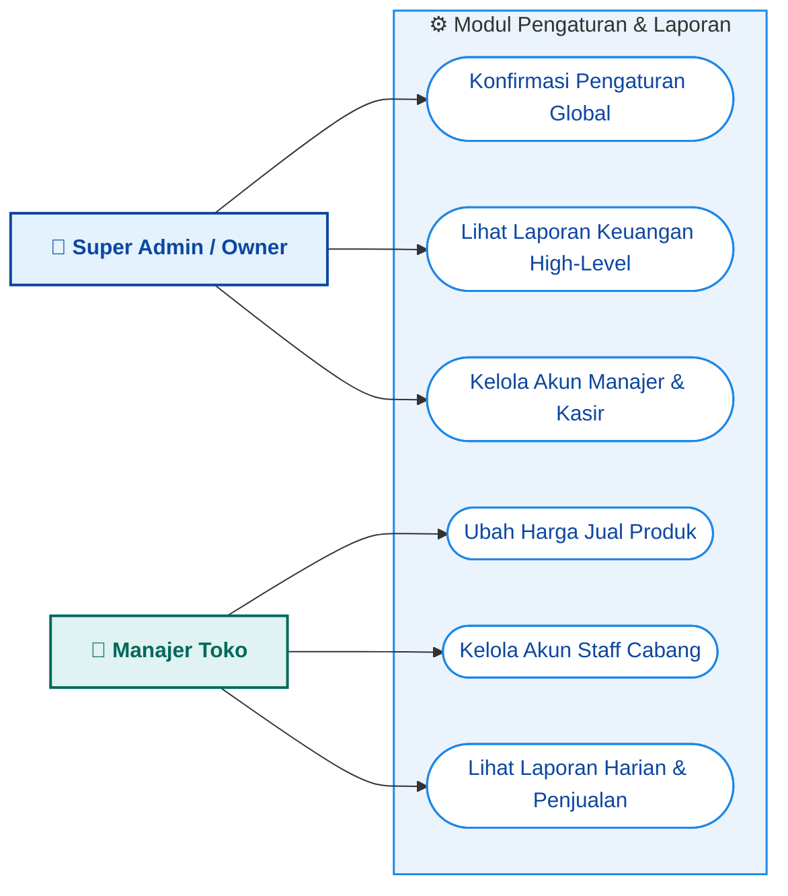
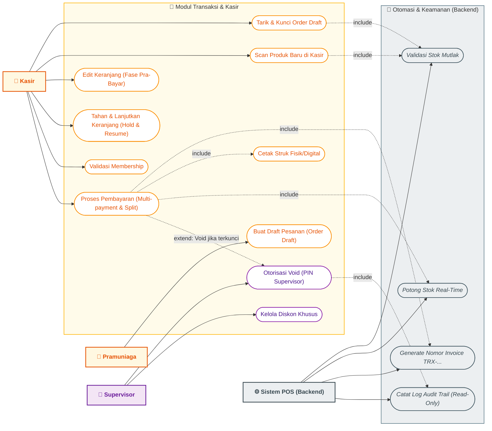
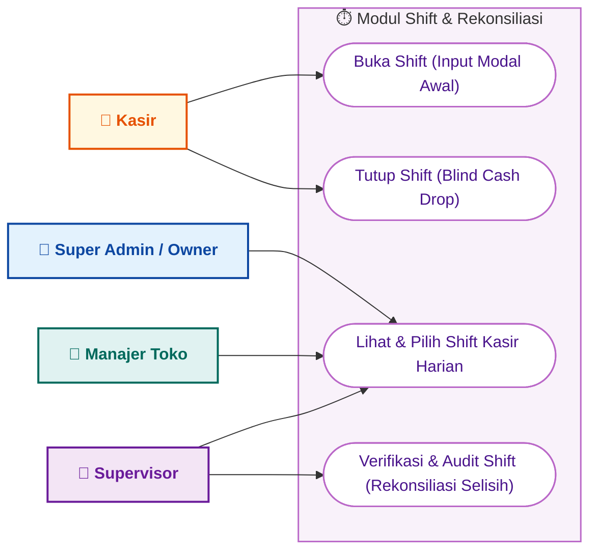
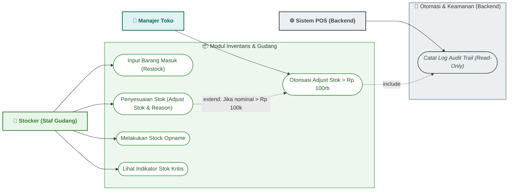
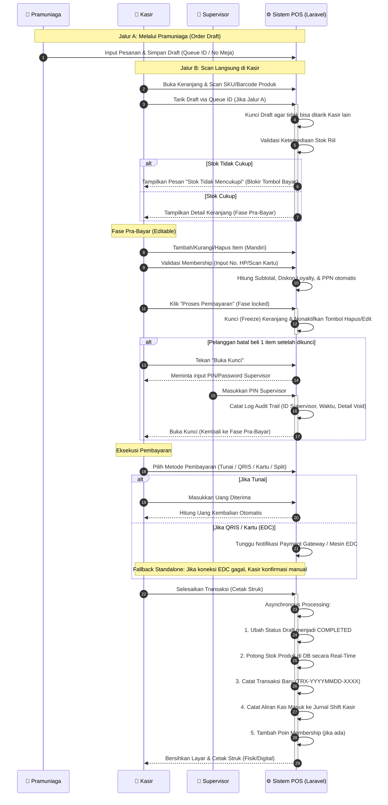

# Usecase Diagram & Penjelasan Alur Sistem Point of Sale (POS)

Dokumen ini berisi kode **Mermaid.js** untuk diagram usecase sistem Point of Sale (POS) berdasarkan Product Requirements Document (PRD) yang telah didefinisikan, beserta penjelasan detail mengenai alur kerja (workflow) masing-masing usecase.

---

## 1. Diagram Usecase (Mermaid.js)

Berikut adalah diagram usecase yang memetakan hubungan antara **Aktor** (Internal & Sistem) dengan fungsionalitas di dalam sistem POS yang terbagi ke dalam beberapa modul.

### A. High-Level System Overview Diagram
Diagram tingkat tinggi ini memetakan relasi antara **Aktor** dengan modul-modul utama di dalam Sistem POS untuk melihat alur tanggung jawab secara ringkas dan bersih.

```mermaid
graph TD
    %% ==========================================
    %% HIGH-LEVEL SYSTEM OVERVIEW USE CASE DIAGRAM
    %% ==========================================
    
    %% Actors Definition
    SuperAdmin["👤 Super Admin / Owner"]
    Manager["👤 Manajer Toko"]
    Supervisor["👤 Supervisor"]
    Kasir["👤 Kasir"]
    Pramuniaga["👤 Pramuniaga"]
    Stocker["👤 Stocker (Staf Gudang)"]
    SistemLaravel["⚙️ Sistem POS (Backend)"]

    %% Modules / Subsystems (Boundary representation)
    subgraph Sistem_POS ["Sistem POS (Point of Sale)"]
        ModulAdmin["⚙️ Modul Pengaturan & Keuangan<br/>(Global Settings & Financial Reports)"]
        ModulKasir["🛒 Modul Transaksi & Kasir<br/>(Order Drafts & Payments)"]
        ModulShift["⏱️ Modul Shift & Rekonsiliasi<br/>(Reconciliation & Audits)"]
        ModulGudang["📦 Modul Gudang & Inventaris<br/>(Restock, Opname & Adjustments)"]
        ModulOtomasi["🤖 Modul Otomasi & Keamanan<br/>(Validation, Auto-cut, Audit Trail)"]
    end

    %% Actor to Module Connections (Very clean layout)
    SuperAdmin --> ModulAdmin
    
    Manager --> ModulAdmin
    Manager --> ModulGudang
    
    Supervisor --> ModulKasir
    Supervisor --> ModulShift
    
    Kasir --> ModulKasir
    Kasir --> ModulShift
    
    Pramuniaga --> ModulKasir
    
    Stocker --> ModulGudang
    
    SistemLaravel --> ModulOtomasi

    %% ==========================================
    %% BEAUTIFUL CUSTOM STYLING (CSS classes)
    %% ==========================================
    style Sistem_POS fill:#FAFAFA,stroke:#37474F,stroke-width:3px,stroke-dasharray: 5 5;
    style ModulAdmin fill:#EBF3FC,stroke:#1E88E5,stroke-width:1.5px;
    style ModulKasir fill:#FFFBEA,stroke:#FFB300,stroke-width:1.5px;
    style ModulShift fill:#F9F2FA,stroke:#BA68C8,stroke-width:1.5px;
    style ModulGudang fill:#EEF7EE,stroke:#4CAF50,stroke-width:1.5px;
    style ModulOtomasi fill:#ECEFF1,stroke:#607D8B,stroke-width:1.5px;

    %% Class Definitions for Actors
    classDef adminStyle fill:#E3F2FD,stroke:#0D47A1,stroke-width:2.5px,color:#0D47A1,font-weight:bold;
    classDef managerStyle fill:#E0F2F1,stroke:#00695C,stroke-width:2.5px,color:#00695C,font-weight:bold;
    classDef supervisorStyle fill:#F3E5F5,stroke:#6A1B9A,stroke-width:2.5px,color:#6A1B9A,font-weight:bold;
    classDef staffStyle fill:#FFF8E1,stroke:#E65100,stroke-width:2.5px,color:#E65100,font-weight:bold;
    classDef stockerStyle fill:#E8F5E9,stroke:#2E7D32,stroke-width:2.5px,color:#2E7D32,font-weight:bold;
    classDef systemStyle fill:#ECEFF1,stroke:#37474F,stroke-width:2.5px,color:#37474F,font-weight:bold;
    
    %% Apply Styles to Actors
    class SuperAdmin adminStyle;
    class Manager managerStyle;
    class Supervisor supervisorStyle;
    class Kasir,Pramuniaga staffStyle;
    class Stocker stockerStyle;
    class SistemLaravel systemStyle;
```



---

### B. Detail Usecase - Modul Pengaturan & Laporan
Modul ini digunakan oleh **Super Admin** dan **Manajer Toko** untuk mengonfigurasi pengaturan sistem global, mengubah harga produk, mengelola akun bawahan, serta melihat laporan keuangan.



---

### C. Detail Usecase - Modul Transaksi & Kasir
Modul inti yang melayani transaksi penjualan dari pembuatan draf pesanan oleh **Pramuniaga**, pemrosesan pembayaran oleh **Kasir**, otorisasi pembatalan/void oleh **Supervisor**, hingga aksi otomatis pemotongan stok oleh **Sistem Backend**.



---

### D. Detail Usecase - Modul Shift & Rekonsiliasi
Modul penanganan siklus kerja harian kasir untuk pembukaan modal kas harian, input setoran uang tunai akhir (*blind cash drop*), serta proses audit selisih kas oleh **Supervisor**.



---

### E. Detail Usecase - Modul Gudang & Inventaris
Modul pengelolaan data barang masuk dan penyesuaian stok yang dilakukan oleh **Stocker**, dengan batasan finansial otorisasi dari **Manajer Toko** jika penyesuaian bernilai besar.



---

## 2. Penjelasan Peran Aktor (Actor Roles)

1. **Super Admin / Owner (Aktor Utama)**
   * Memiliki kontrol mutlak atas sistem global, pengaturan toko/cabang, integrasi pembayaran, dan memiliki akses penuh ke laporan keuangan laba rugi tingkat tinggi. Mengelola kredensial untuk manajer dan kasir.
2. **Manajer Toko (Aktor Utama)**
   * Bertanggung jawab atas operasional cabang harian. Berhak mengubah harga jual produk, mengelola akun karyawan di bawahnya, dan memberikan otorisasi PIN jika ada penyesuaian stok bernilai > Rp 100.000.
3. **Supervisor (Aktor Utama)**
   * Pengawas lapangan yang bertindak sebagai jembatan operasional. Memiliki kewenangan otorisasi khusus (Void) ketika keranjang belanja kasir terkunci, mengaudit sesi shift kasir, dan mengelola diskon harian.
4. **Stocker / Staf Gudang (Aktor Utama)**
   * Bertanggung jawab penuh terhadap arus fisik barang di gudang. Menginput barang masuk, mencocokkan stok (opname), dan mengusulkan penyesuaian stok dengan batasan finansial. Aktor ini diblokir total dari fungsi transaksi keuangan atau kasir.
5. **Pramuniaga (Aktor Utama)**
   * Kru toko yang membantu pemesanan pelanggan di antrean/meja melalui tablet. Hanya memiliki akses membuat draf keranjang belanja (Order Draft) tanpa hak akses pembayaran atau manipulasi harga.
6. **Kasir (Aktor Utama)**
   * Pelaksana transaksi pembayaran akhir di meja kasir. Mengambil draf dari Pramuniaga atau memproses barang belanjaan langsung, menerima berbagai metode pembayaran, serta melakukan pencocokan modal kas harian (Shift).
7. **Sistem POS / Backend Laravel (Aktor Pendukung/Sistem)**
   * Menjalankan logika bisnis otomatis di latar belakang seperti validasi stok mutlak, pemotongan kuantitas stok real-time, pembatalan draf kedaluwarsa, pembuatan nomor invoice berformat unik, dan pencatatan log audit.

---

## 3. Penjelasan Alur Proses Utama (Core Workflows)

### A. Alur Pemesanan Hingga Pembayaran (Order-to-Payment Workflow)

Alur ini memproses transaksi dari pemilihan produk hingga struk dicetak dan stok dipotong:



---

### B. Alur Manajemen Shift & Audit Kas (Shift & Cash Reconciliation Workflow)

Alur ini digunakan untuk mengontrol arus keluar masuk uang tunai di laci kasir serta meminimalisir fraud/kecurangan:

```mermaid
sequenceDiagram
    autonumber
    actor K as 👤 Kasir
    actor SPV as 👤 Supervisor
    participant S as ⚙️ Sistem POS (Laravel)
    database DB as 🗄️ Database
    
    Note over K, DB: 1. Alur Awal Shift (Open Shift)
    K->>S: Login ke POS
    activate S
    S->>DB: Cek status shift kasir aktif
    DB-->>S: Tidak ada shift aktif (Layar terkunci)
    S-->>K: Tampilkan Pop-up "Buka Shift & Masukkan Modal Awal"
    deactivate S
    
    K->>S: Input Uang Modal Awal (misal: Rp 200.000)
    activate S
    S->>DB: Buat ID Shift baru (SHIFT-YYYYMMDD-XXXX) & simpan modal awal
    DB-->>S: Konfirmasi shift aktif
    S-->>K: Buka Kunci POS (POS siap digunakan transaksi)
    deactivate S

    Note over K, DB: 2. Alur Akhir Shift (Close Shift - Blind Cash Drop)
    K->>S: Klik "Tutup Shift"
    activate S
    S-->>K: Tampilkan Form "Blind Cash Drop" (Input Uang Fisik)
    Note over S, K: Sistem TIDAK menampilkan ekspektasi nominal di layar kasir
    deactivate S
    
    K->>S: Masukkan Nominal Uang Fisik Hasil Hitungan Manual
    activate S
    S->>DB: Simpan input uang fisik & ubah status shift menjadi CLOSED
    S->>DB: Catat timestamp logout kasir
    DB-->>S: Shift berhasil ditutup
    S-->>K: Logout otomatis (Layar terkunci kembali)
    deactivate S

    Note over SPV, DB: 3. Alur Verifikasi & Audit Shift
    SPV->>S: Buka Modul "Shift Audit"
    activate S
    S->>DB: Tarik data shift closed yang belum diverifikasi
    DB-->>S: Mengembalikan data (Modal awal, Penjualan tunai, Input fisik kasir)
    S->>S: Hitung Ekspektasi = Modal Awal + Total Penjualan Tunai
    S->>S: Hitung Selisih = Input Fisik Kasir - Ekspektasi
    
    alt Selisih == Rp 0 (Balance)
        S-->>SPV: Tampilkan status "BALANCE (Aman)"
    else Selisih != Rp 0 (Discrepancy)
        S-->>SPV: Tampilkan status "DISCREPANCY (Red Flag)" beserta nominal selisih
    end
    deactivate S
    
    SPV->>S: Konfirmasi & Verifikasi Hasil Audit Shift
    activate S
    S->>DB: Simpan status audit & catatan rekonsiliasi
    DB-->>S: Sukses
    S-->>SPV: Audit Shift Selesai
    deactivate S
```

1. **Awal Shift (Open Shift):**
   * Kasir login ke sistem POS.
   * Sistem secara otomatis mengunci layar dan meminta input **Modal Awal** (uang pecahan kembalian di laci).
   * Sistem menghasilkan ID Shift unik (misal: `SHIFT-0001`) dan merekam waktu pembukaan shift serta ID Kasir.
2. **Operasional & Penutupan Shift (Close Shift):**
   * Kasir melayani transaksi. Setiap pembayaran tunai langsung diakumulasikan di latar belakang oleh sistem ke dalam kas saldo shift tersebut.
   * Saat jam kerja berakhir, Kasir menekan **Tutup Shift**.
   * Sistem menjalankan metode **Blind Cash Drop**: Kasir wajib menghitung uang fisik yang ada di laci (Uang Modal + Uang Hasil Penjualan Tunai) dan menginput jumlahnya secara manual ke sistem.
   * *Keamanan:* Kasir sama sekali tidak diperlihatkan angka ekspektasi sistem untuk mencegah manipulasi input agar pas.
   * Setelah input dikirim, status shift berubah menjadi `CLOSED` dan kasir otomatis log out.
3. **Monitoring & Audit Verifikasi (Oleh Supervisor/Manajer/Owner):**
   * Pihak manajemen (Supervisor, Manajer, atau Owner) membuka dashboard monitoring shift harian.
   * Pengguna menggunakan date picker untuk memilih tanggal, lalu sistem memunculkan semua shift kasir yang aktif atau selesai pada hari itu (misal 3 kasir berbeda).
   * Pengguna memilih salah satu kasir dari daftar untuk meninjau detail laci kas secara spesifik.
   * Sistem secara otomatis menghitung selisih menggunakan rumus:
     $$\text{Selisih} = \text{Uang Fisik di-input Kasir} - (\text{Modal Awal} + \text{Total Penjualan Tunai})$$
   * **Status Balance (Rp 0):** Rekonsiliasi sukses dan aman.
   * **Status Discrepancy (Minus/Plus):** Terjadi ketidakcocokan. Sistem menandai transaksi dengan bendera merah (Red Flag) untuk diaudit lebih lanjut ke Kasir yang bersangkutan.

---

### C. Alur Penyesuaian Stok (Inventory Stock Adjustment Workflow)

Alur ini membatasi kewenangan penyesuaian stok agar tidak terjadi manipulasi data inventaris:

```mermaid
sequenceDiagram
    autonumber
    actor ST as 👤 Stocker (Staf Gudang)
    actor M as 👤 Manajer Toko
    participant S as ⚙️ Sistem POS (Laravel)
    database DB as 🗄️ Database

    ST->>S: Buka Modul Penyesuaian Stok
    ST->>S: Pilih Produk, Input Qty Selisih, & Pilih Reason Code (Rusak/Expired/Opname)
    activate S
    S->>S: Hitung Total Nilai Finansial Penyesuaian (Qty * Harga Beli)
    
    alt Nilai Penyesuaian <= Rp 100.000 (Eksekusi Mandiri)
        S->>DB: Update Stok Produk secara Real-time
        S->>DB: Catat ke Audit Trail (Read-only)
        DB-->>S: Sukses
        S-->>ST: Penyesuaian Stok Berhasil Diterapkan
    else Nilai Penyesuaian > Rp 100.000 (Butuh Otorisasi Manajer)
        S->>DB: Simpan draf penyesuaian dengan status "PENDING_APPROVAL"
        DB-->>S: Sukses
        S-->>ST: Pengajuan Tertahan. Butuh Otorisasi Manajer Toko.
    end
    deactivate S

    Note over M, DB: Otorisasi oleh Manajer Toko
    M->>S: Buka Modul "Pending Stock Adjustments"
    activate S
    S->>DB: Tarik daftar pengajuan status PENDING_APPROVAL
    DB-->>S: Tampilkan list pengajuan
    S-->>M: Tampilkan list pengajuan
    deactivate S

    M->>S: Setujui Pengajuan & Masukkan PIN/Password Manajer
    activate S
    S->>S: Validasi PIN/Password Manajer
    alt PIN Valid
        S->>DB: Update Stok Produk di Database
        S->>DB: Catat ke Audit Trail (ID Manajer, Detail Barang, Waktu)
        DB-->>S: Sukses
        S-->>M: Otorisasi Sukses, Stok Diperbarui
    else PIN Invalid
        S-->>M: PIN Salah, Otorisasi Ditolak
    end
    deactivate S
```

1. **Stocker Melakukan Opname / Menemukan Selisih:**
   * Stocker melakukan pemeriksaan fisik dan menemukan ketidakcocokan dengan data digital di sistem POS.
2. **Proses Input Penyesuaian (Adjust Stok):**
   * Stocker menginput produk yang akan disesuaikan dan wajib memilih **Reason Code** yang relevan (*Barang Rusak, Kedaluwarsa, atau Selisih Fisik Opname*).
3. **Pemberlakuan Batasan Finansial (Financial Constraints):**
   * **Nilai Selisih $\le$ Rp 100.000:** Sistem langsung memvalidasi perubahan stok dan data langsung terbarui secara otomatis.
   * **Nilai Selisih > Rp 100.000:** Sistem secara otomatis mengunci pengajuan tersebut dan mengubah status menjadi *Pending Approval*.
4. **Otorisasi Manajer Toko:**
   * Manajer Toko harus meninjau pengajuan penyesuaian yang tertahan tersebut.
   * Manajer memasukkan **PIN/Password Manajer** untuk menyetujui.
   * Begitu disetujui, sistem akan:
     * Melakukan pembaharuan stok di database.
     * Mencatat detail kejadian ke **Audit Trail** secara permanen (Read-Only) guna keperluan audit di masa mendatang.


---

## 4. Aturan Bisnis Terkait Usecase (Business Rules Mapping)

* **Validasi Stok Mutlak (Absolute Stock Validation):** Tombol pembayaran akan dikunci otomatis jika jumlah barang di keranjang melebihi stok fisik pada database.
* **Integritas Harga (Price Integrity):** Kunci tingkat database mencegah peran Kasir dan Pramuniaga mengubah harga dasar produk (hanya Manajer/Owner yang memiliki hak akses ini).
* **Format Invoice Unik:** Semua transaksi sukses menghasilkan nomor invoice format `TRX-YYYYMMDD-XXXX` yang ter-reset otomatis setiap hari baru (misalnya dari `TRX-20260607-0020` kembali ke `TRX-20260608-0001`).
* **Siklus Hidup Draft (Draft Lifecycle):** Order Draft yang dibuat oleh Pramuniaga akan otomatis kedaluwarsa setelah 2 jam atau ketika hari berganti untuk mencegah penumpukan data keranjang yang tidak diselesaikan.
* **Mode Offline (Offline Fallback):** Jika koneksi ke cloud terputus, usecase transaksi kasir tetap dapat berjalan memanfaatkan penyimpanan lokal (offline cache), lalu data disinkronkan otomatis setelah internet kembali normal.
* **Log Audit Trail:** Setiap pembatalan (Void) di fase locked atau penyesuaian stok bernilai besar wajib dicatat ke tabel `audit_logs` dan tidak dapat dihapus oleh siapa pun (termasuk Super Admin).
